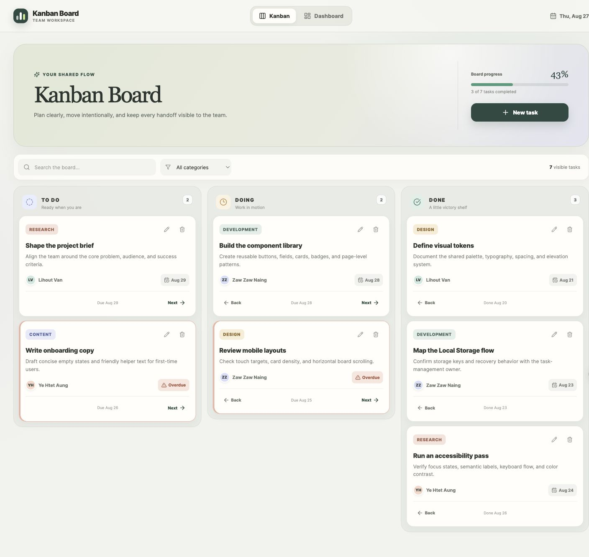
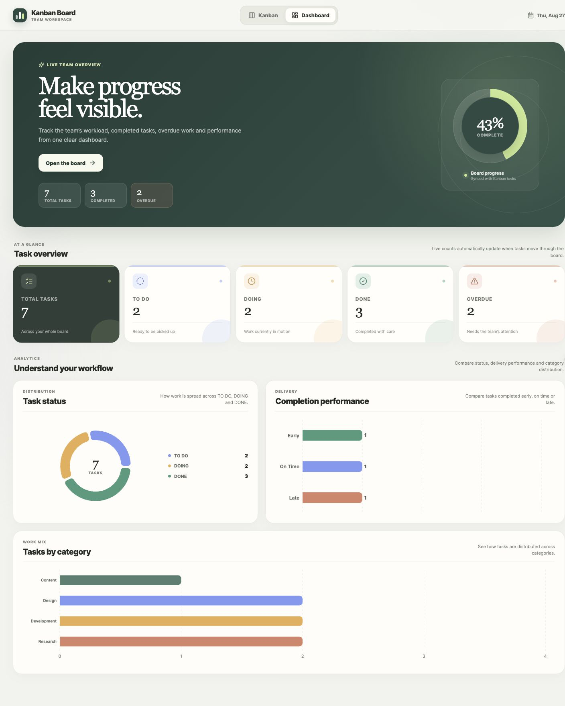
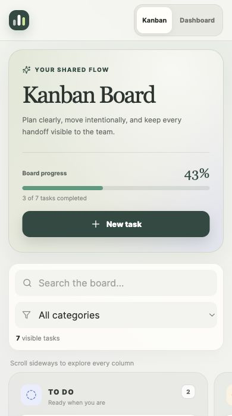

# Flowboard — Kanban Board with Dashboard

A responsive React application for organizing team tasks on a three-stage Kanban board and reviewing progress through a visual dashboard. Tasks and custom categories are stored entirely in the browser, so the application requires no backend and keeps its data after a page refresh.

> **Before submission:** Replace the repository URL, deployed URL, member-name placeholders, and screenshot placeholders in this README.

## Links

- **GitHub repository:** `https://github.com/Geordie-oG/Project1_Kanban-Board`
- **Deployed application:** `https://geordie-og.github.io/Project1_Kanban-Board/` *(available after the tested `develop` branch is merged into `main`)*

## Features

### Kanban Board

- Three task columns: **TO DO**, **DOING**, and **DONE**
- Create, edit, and delete tasks
- Move tasks left or right through the workflow
- Automatically record today's completion date when a task enters **DONE**
- Clear the completion date when a task leaves **DONE**
- Assign a category and responsible person to each task
- Set task descriptions, start dates, and due dates
- Add reusable custom categories
- Search tasks by title or description and filter the board by category
- Visually highlight overdue unfinished tasks
- Show responsive empty states, task counts, and overall board progress

### Dashboard

- Five live summary cards for total, TO DO, DOING, DONE, and overdue tasks
- Doughnut chart showing the task-status distribution
- Bar chart showing tasks grouped by category
- Completion-performance chart comparing early, on-time, and late work
- Responsive layouts for desktop, tablet, and mobile screens

## Screenshots

Add the final screenshots to the paths below after the application has been integrated and deployed.

| View | File to add |
| --- | --- |
| Kanban Board — desktop | `docs/screenshots/kanban-board.png` |
| Dashboard — desktop | `docs/screenshots/dashboard.png` |
| Responsive mobile view | `docs/screenshots/mobile-view.png` |

Once the files are added, replace this note with the following Markdown:

```md



```

## Tech Stack

- React 19
- Vite 8
- React Router 7 with hash-based routing
- Recharts 3
- Lucide React icons
- Custom responsive CSS
- Browser Local Storage
- GitHub Actions and GitHub Pages

## Getting Started

### Prerequisites

- Node.js `>=20.19.0`
- npm

### Run locally

```bash
git clone YOUR_REPOSITORY_URL
cd YOUR_REPOSITORY_FOLDER
npm ci
npm run dev
```

Open the local URL printed by Vite in your browser.

### Create a production build

```bash
npm run build
npm run preview
```

### Run quality checks

```bash
npm test
npm run lint
```

## Basic Usage

1. Open **Kanban Board** from the navigation bar.
2. Select **New Task** and enter the required task information.
3. Choose an existing category, or add a category for future tasks.
4. Use a task card's controls to edit, delete, or move the task.
5. Move a completed task into **DONE** to record its completion date.
6. Use the search box or category filter to focus the board.
7. Open **Dashboard** to review status, category, overdue, and completion metrics.

## Data Model and Persistence

The app has no backend. Its shared task context reads from Local Storage when the application starts and writes changes after task or category updates. On a first visit, the app loads demonstration tasks and categories from `src/data/sampleTasks.js`; subsequent visits use the saved browser data.

| Local Storage key | Stored value |
| --- | --- |
| `kanban_tasks_v1` | Array of task objects |
| `kanban_categories_v1` | Array of reusable categories |

A task contains the following fields:

```js
{
  id: "unique-id",
  title: "Task title",
  description: "Task description",
  category: "Category name",
  startDate: "YYYY-MM-DD",
  dueDate: "YYYY-MM-DD",
  completeDate: "YYYY-MM-DD", // empty until completed
  responsiblePersonId: "person-id",
  status: "TODO" // TODO | DOING | DONE
}
```

Removing the two keys above from browser storage resets locally saved task and category data for that browser and site.

The responsible-person list currently contains demonstration entries in `src/data/people.js`. Replace them with the names and IDs supplied by the instructor before final submission; person management is intentionally not part of the app.

## Dashboard Calculations

The dashboard derives every value from the current `tasks` array:

| Metric | Calculation |
| --- | --- |
| Total | All tasks |
| TO DO | Tasks whose status is `TODO` |
| DOING | Tasks whose status is `DOING` |
| DONE | Tasks whose status is `DONE` |
| Overdue | Due date is before today and status is not `DONE` |
| Early | Completion date is before the due date |
| On Time | Completion date equals the due date |
| Late | Completion date is after the due date |

Only completed tasks with both a due date and completion date are included in completion-performance totals. Dates use the `YYYY-MM-DD` format so day-level comparisons remain consistent.

## Application Structure

```text
.
├── .github/workflows/deploy.yml
├── src/
│   ├── components/
│   │   ├── charts/
│   │   │   ├── CategoryChart.jsx
│   │   │   ├── ChartEmptyState.jsx
│   │   │   ├── PerformanceChart.jsx
│   │   │   └── StatusChart.jsx
│   │   ├── ChartCard.jsx
│   │   ├── KanbanColumn.jsx
│   │   ├── Navbar.jsx
│   │   ├── SummaryCard.jsx
│   │   ├── TaskCard.jsx
│   │   └── TaskForm.jsx
│   ├── context/
│   │   ├── taskContext.js
│   │   ├── TaskContext.jsx
│   │   └── useTasks.js
│   ├── data/
│   │   ├── people.js
│   │   └── sampleTasks.js
│   ├── pages/
│   │   ├── DashboardPage.jsx
│   │   └── KanbanPage.jsx
│   ├── utils/
│   │   ├── storage.js
│   │   ├── taskHydration.js
│   │   └── taskCalculations.js
│   ├── App.jsx
│   ├── main.jsx
│   └── styles.css
├── tests/
│   ├── taskCalculations.test.js
│   └── taskHydration.test.js
├── index.html
├── package.json
└── vite.config.js
```

`main.jsx` wraps the app in `HashRouter` and `TaskProvider`. The shared task context owns tasks, categories, CRUD operations, movement, and persistence. Both pages consume that same state, while pure calculation helpers transform it into dashboard totals and chart data.

## Branch Workflow

| Work area | Branch |
| --- | --- |
| Kanban Board | `feature/kanban-board` |
| Task and data management | `feature/task-management` |
| Dashboard and delivery | `feature/dashboard` |

Each feature branch is reviewed and merged into `develop`. After integration and acceptance testing, `develop` is merged into `main`; a push to `main` triggers the GitHub Pages deployment workflow.

## Deployment

The workflow at `.github/workflows/deploy.yml` installs locked dependencies, runs the automated tests and linter, builds the app, uploads `dist`, and deploys it to GitHub Pages.

To enable deployment for the repository:

1. Open **Settings → Pages** in GitHub.
2. Set **Source** to **GitHub Actions**.
3. Push or merge the tested application into `main`.
4. Check the **Actions** tab, then test both application routes on the deployed URL.

The Vite build uses relative asset paths (`base: './'`) and the app uses `HashRouter`, so a repository-specific GitHub Pages base path does not need to be hard-coded. The deployed routes appear as `#/kanban` and `#/dashboard`, which also remain available after a browser refresh.

## Final Acceptance Checklist

- [ ] Task creation, editing, and deletion work correctly
- [ ] Tasks move correctly between all three statuses
- [ ] Entering and leaving DONE updates the completion date correctly
- [ ] Categories can be added, selected, and restored after refresh
- [ ] Tasks are restored from Local Storage after refresh
- [ ] All five dashboard totals match the board data
- [ ] Status, category, and completion charts update from real task data
- [ ] Overdue styling and totals follow the agreed definition
- [ ] Kanban and Dashboard pages work on desktop and mobile
- [ ] Direct navigation and refresh work on the deployed site
- [ ] Final screenshots, names, repository URL, and deployed URL are present
- [ ] No generated build artifacts are committed

## Team Members

- `[Member A Name]`
- `[Member B Name]`
- `[Member C Name]`
